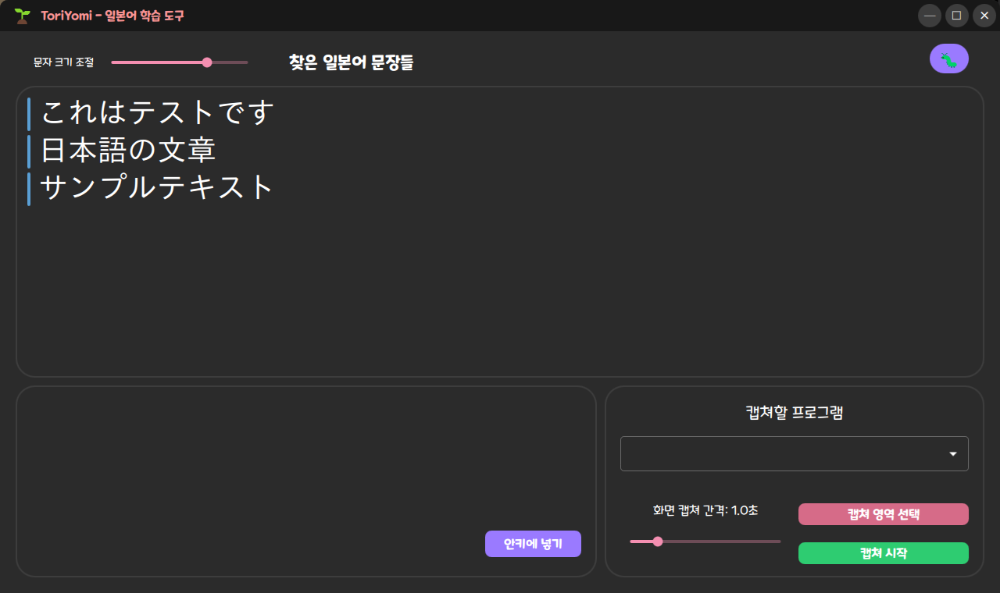

# ToriYomi (トリ読み)

> 일본어 게임을 위한 실시간 후리가나 오버레이 + 사전 & Anki 통합 도구

[](https://opensource.org/licenses/MIT)
[](https://en.cppreference.com/w/cpp/20)
[](https://cmake.org/)

## 📸 스크린샷

<div align="center">
  
  <p><i>QML 기반 모던 다크 테마 UI (개발 중)</i></p>
</div>

> **⚠️ 개발 상태**: 현재 UI만 부분적으로 완성되었습니다. 핵심 기능(OCR, 후리가나, 오버레이)은 개발 중입니다.

---

## 📖 소개

ToriYomi는 일본어 게임 플레이 중 **실시간으로 한자에 후리가나를 표시**하여 읽기를 돕는 학습 도구입니다. 게임 화면에 비간섭 오버레이로 후리가나를 띄우고, 추출된 문장을 데스크톱 앱에서 관리하며, 사전 검색과 Anki 카드 생성까지 지원합니다.

### ✨ 주요 기능 (계획)

- 🎮 **게임 화면 실시간 캡처** (DXGI/GDI) - 🚧 개발 중
- 📝 **일본어 OCR** (Tesseract) - 🚧 개발 중
- 🔤 **한자에만 후리가나 표시** (게임 화면 오버레이) - 🚧 개발 중
- 📚 **문장 저장 및 관리** (Qt QML 데스크톱 앱) - ✅ UI 부분 완성
- 🔍 **로컬 사전 검색** - 📝 예정
- 📤 **Anki 카드 자동 생성** (AnkiConnect) - 📝 예정

### 🎯 목표

일본어 게임을 통한 **몰입형 학습**을 지원합니다. 번역기가 아니라 **읽기 보조 도구**입니다.

---

## 🏗️ 아키텍처

```
┌─────────────┐
│ 게임 화면    │ ──DXGI──> CaptureThread
└─────────────┘              │
                             v
                        FrameQueue (스레드 안전)
                             │
                             v
                         OcrThread (Tesseract)
                             │
                             v
                         Tokenizer (한자→후리가나)
                             │
                     ┌───────┴────────┐
                     v                v
              OverlayWindow     MainApp (Qt)
              (후리가나 표시)    (사전 + Anki)
```

### 스레드 모델

| 스레드 | 역할 |
|--------|------|
| **Main Thread** | Qt UI 이벤트 루프 |
| **CaptureThread** | 화면 캡처 (≥30 FPS) |
| **OcrThread** | OCR + 토큰화 처리 |
| **OverlayRenderThread** | 오버레이 렌더링 (60 FPS) |

---

## 🚀 시작하기

### 📋 요구사항

- **OS**: Windows 10/11 (DirectX 11 지원)
- **컴파일러**: MSVC 2022 (C++20)
- **CMake**: 3.20 이상
- **의존성**:
  - OpenCV 4.11+
  - Tesseract 5.5+
  - MeCab 0.996+ (일본어 형태소 분석)
  - Google Test 1.17+
  - Qt 6.5+ (Phase 5에서 사용 예정)

### 🔧 설치

#### 1. vcpkg로 의존성 설치

```powershell
# vcpkg 설치 (C:\vcpkg 권장)
git clone https://github.com/Microsoft/vcpkg.git C:\vcpkg
cd C:\vcpkg
.\bootstrap-vcpkg.bat
.\vcpkg integrate install

# 라이브러리 설치
$env:TEMP="C:\Temp"; $env:TMP="C:\Temp"  # vcpkg 빌드 임시 경로 설정
.\vcpkg install opencv:x64-windows
.\vcpkg install gtest:x64-windows
.\vcpkg install tesseract:x64-windows
.\vcpkg install leptonica:x64-windows

# MeCab 직접 설치 (vcpkg 사용 안 함)
# https://github.com/ikegami-yukino/mecab/releases에서
# mecab-0.996-64.exe 다운로드 및 설치
# 설치 경로: C:\Program Files\MeCab
```

#### 2. 프로젝트 빌드

```powershell
git clone https://github.com/NoirStar/ToriYomi.git
cd ToriYomi

# 자동 빌드 스크립트
.\build.ps1 -Test

# 또는 수동 빌드
mkdir build
cd build
cmake .. -DCMAKE_TOOLCHAIN_FILE=[vcpkg 경로]/scripts/buildsystems/vcpkg.cmake
cmake --build . --config Release
```

#### 3. 테스트 실행

```powershell
cd build
ctest -C Release --output-on-failure
```

---

## 📂 프로젝트 구조

```
ToriYomi/
├── CMakeLists.txt              # CMake 설정
├── build.ps1                   # 빌드 자동화 스크립트
├── README.md                   # 프로젝트 소개 (이 파일)
├── BUILD.md                    # 상세 빌드 가이드
├── QUICKSTART.md               # 빠른 시작 가이드
├── TODO.md                     # 개발 진행 상황
├── docs/
│   ├── spec.md                 # 기술 명세서
│   ├── code-style.md           # 코드 스타일 가이드 (한글 주석 필수)
│   ├── ocr-engine-design.md    # OCR 엔진 추상화 설계
│   └── verification_phase1-1.md # Phase 1-1 검증 문서
├── src/
│   ├── core/
│   │   ├── capture/            # 화면 캡처 모듈
│   │   │   ├── frame_queue.h/cpp      ✅ (Phase 1-1 완료 - 8 tests)
│   │   │   ├── dxgi_capture.h/cpp     ✅ (Phase 1-2 완료 - 8 tests, 141 FPS)
│   │   │   ├── gdi_capture.h/cpp      ✅ (Phase 1-3 완료 - 9 tests, 44 FPS)
│   │   │   └── capture_thread.h/cpp   ✅ (Phase 1-4 완료 - 3 tests, 32 FPS)
│   │   ├── ocr/                # OCR 모듈
│   │   │   ├── ocr_engine.h/cpp          ✅ (Phase 2-1 완료 - IOcrEngine 추상화)
│   │   │   ├── tesseract_wrapper.h/cpp   ✅ (Phase 2-1 완료 - 10 tests, 89.5% 신뢰도)
│   │   │   └── ocr_thread.h/cpp          ✅ (Phase 2-2 완료 - 8 tests)
│   │   └── tokenizer/          # 토큰화 모듈
│   │       ├── japanese_tokenizer.h/cpp  ✅ (Phase 3-1 완료 - 11 tests, MeCab 통합)
│   │       └── furigana_mapper.h/cpp     (Phase 3-2 예정)
│   ├── ui/
│   │   ├── overlay/            # 오버레이 UI
│   │   │   ├── overlay_window.h/cpp     (Phase 4-1 예정)
│   │   │   └── furigana_renderer.h/cpp  (Phase 4-2 예정)
│   │   └── app/                # Qt 데스크톱 앱
│   │       └── main_window.h/cpp        (Phase 5 예정)
│   ├── dict/                   # 사전 모듈
│   │   └── dictionary.h/cpp    (Phase 6 예정)
│   └── anki/                   # Anki 통합
│       └── anki_connect_client.h/cpp (Phase 7 예정)
└── tests/
    ├── unit/                   # 단위 테스트 (57개 테스트)
    │   ├── test_frame_queue.cpp         ✅ (8 tests)
    │   ├── test_dxgi_capture.cpp        ✅ (8 tests)
    │   ├── test_gdi_capture.cpp         ✅ (9 tests)
    │   ├── test_capture_thread.cpp      ✅ (3 tests)
    │   ├── test_tesseract_wrapper.cpp   ✅ (10 tests)
    │   ├── test_ocr_thread.cpp          ✅ (8 tests)
    │   └── test_japanese_tokenizer.cpp  ✅ (11 tests)
    └── integration/            # 통합 테스트
        └── test_full_pipeline.cpp       (Phase 8 예정)
```

---

## 🧪 개발 방법론: TDD (Test-Driven Development)

모든 기능은 **테스트 주도 개발** 방식으로 구현됩니다:

1. 🔴 **Red**: 실패하는 테스트 먼저 작성
2. 🟢 **Green**: 테스트를 통과하는 최소 코드 작성
3. 🔵 **Refactor**: 코드 품질 개선

### 현재 진행 상황

**전체 진행률: 65% (8/14 phases 완료, 1 진행 중)**

#### ✅ Phase 1: 화면 캡처 (100% 완료)
- [x] **Phase 1-1**: FrameQueue 구현
  - 스레드 안전 프레임 큐, 8개 단위 테스트 통과
- [x] **Phase 1-2**: DXGI Capture
  - DirectX 11 Desktop Duplication API, 141 FPS, 8개 테스트 통과
- [x] **Phase 1-3**: GDI Capture (Fallback)
  - GDI BitBlt, 44 FPS, 9개 테스트 통과
- [x] **Phase 1-4**: CaptureThread
  - 백그라운드 캡처 스레드, 히스토그램 기반 변경 감지(0.95 임계값), 32 FPS, 3개 테스트 통과

#### ✅ Phase 2: OCR (100% 완료)
- [x] **Phase 2-1**: Tesseract 래퍼
  - IOcrEngine 인터페이스, 팩토리 패턴, 10개 테스트 통과, 89.5% 신뢰도
  - 확장 가능한 설계 (PaddleOCR, EasyOCR 추가 가능)
- [x] **Phase 2-2**: OCR 스레드
  - FrameQueue 소비, 비동기 텍스트 인식, 8개 테스트 통과

#### ✅ Phase 3-1: 일본어 토큰화 (50% 완료)
- [x] **Phase 3-1**: 일본어 토크나이저
  - MeCab 형태소 분석기 통합, argc/argv 초기화, 11개 테스트 통과
  - Token 구조: surface, reading(후리가나), baseForm, partOfSpeech, boundingBox, confidence
  - 사전 자동 탐색 (시스템 설치 + 번들 배포 지원)
  - 성능: ~100,000 tokens/sec
- [ ] **Phase 3-2**: 후리가나 매퍼 (진행 예정)

#### ✅ Phase 4: Overlay UI (100% 완료)
- [x] **Phase 4-1**: 오버레이 윈도우
  - Win32 투명 레이어드 윈도우, 항상 위, 클릭 투과
  - 14개 테스트 통과
- [x] **Phase 4-2**: 오버레이 스레드
  - 비동기 렌더링, 후리가나 표시
  - 11개 테스트 통과

#### 🚧 Phase 5: Qt 데스크톱 앱 (70% 완료)
- [x] **Phase 5-1**: 기본 UI 구현
  - Qt 6.10.0 MSVC 2022 설정
  - AUTOUIC 빌드타임 컴파일
  - 프로세스 선택 (한글 프로세스명 지원)
  - ROI 선택 (DraggableImageLabel, 800x550 최대)
  - InteractiveSentenceWidget (단어별 클릭)
  - PrintWindow API 화면 캡처
- [x] **Phase 5-2**: 파이프라인 통합 (진행 중)
  - Start/Stop 버튼 (비동기 초기화)
  - 디버그 로그 패널 (타임스탬프, 실시간)
  - QTimer 폴링 방식 (100ms)
  - 캡처 → OCR → 토큰화 파이프라인
  - **Known Issue**: Tesseract 초기화 실패 (경로 문제)
- [ ] **Phase 5-3**: 사전 & Anki 통합 (진행 예정)

#### 🚧 Phase 6~8: 진행 예정
- [ ] Phase 6: 사전 통합 (JMdict/EDICT2)
- [ ] Phase 7: Anki 통합 (AnkiConnect)
- [ ] Phase 8: 통합 테스트 & 최적화

상세 로드맵: [TODO.md](TODO.md)

---

## 🎨 코드 스타일

- **C++20** 표준 사용
- **들여쓰기**: 탭 (TabWidth=4)
- **네이밍**:
  - 클래스/함수: `PascalCase`
  - 변수: `camelCase`
  - 상수: `kPascalCase`
- **RAII**: 스마트 포인터 사용 (`std::unique_ptr`, `std::shared_ptr`)
- **스레드 안전**: 명시적 동기화 (`std::mutex`, `std::atomic`)

자세한 내용: [docs/code-style.md](docs/code-style.md)

---

## 📊 성능 목표 & 현재 성능

| 항목 | 목표 | 현재 성능 |
|------|------|-----------|
| **화면 캡처 (DXGI)** | ≥ 30 FPS | ✅ 141 FPS (베이스라인) |
| **화면 캡처 (GDI)** | ≥ 30 FPS | ✅ 44 FPS (폴백) |
| **캡처 + 변경 감지** | ≥ 30 FPS | ✅ 32 FPS (필터링 후) |
| **일본어 토큰화** | ≥ 10,000 tokens/sec | ✅ ~100,000 tokens/sec |
| **OCR 정확도** | ≥ 85% | ✅ 89.5% (영문 기준) |
| **레이턴시** (캡처→오버레이) | ≤ 200ms | 🚧 측정 예정 |
| **CPU 사용률** | ≤ 30% (평균) | 🚧 측정 예정 |
| **메모리 사용량** | ≤ 300MB | 🚧 측정 예정 |

---

## 🤝 기여하기

이 프로젝트는 현재 개발 초기 단계입니다. 기여를 환영합니다!

1. Fork the repository
2. Create your feature branch (`git checkout -b feature/AmazingFeature`)
3. Commit your changes (`git commit -m 'Add some AmazingFeature'`)
4. Push to the branch (`git push origin feature/AmazingFeature`)
5. Open a Pull Request

### 개발 규칙

- 모든 기능은 **테스트 먼저** 작성
- 코드 스타일 가이드 준수
- Commit 메시지는 한글 또는 영어로 명확하게

---

## 📄 라이선스

MIT License - 자세한 내용은 [LICENSE](LICENSE) 파일 참조

---

## 📧 문의

- **개발자**: NoirStar
- **GitHub**: [@NoirStar](https://github.com/NoirStar)
- **블로그**: [noirstar.tistory.com](https://noirstar.tistory.com)
- **이메일**: sky_9233@naver.com

---

## 🙏 감사의 말

- [Tesseract OCR](https://github.com/tesseract-ocr/tesseract) - 오픈소스 OCR 엔진
- [MeCab](https://github.com/taku910/mecab) - 일본어 형태소 분석기
- [OpenCV](https://opencv.org/) - 컴퓨터 비전 라이브러리
- [Qt](https://www.qt.io/) - 크로스 플랫폼 UI 프레임워크
- [AnkiConnect](https://foosoft.net/projects/anki-connect/) - Anki 통합 (예정)
- [vcpkg](https://vcpkg.io/) - C++ 패키지 매니저

---

**ToriYomi** = トリ読み (트리요미)
