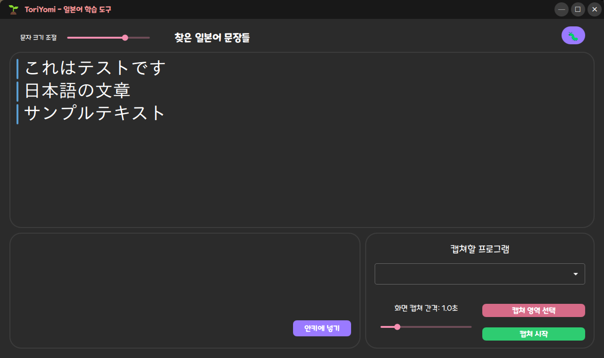

# ToriYomi (トリ読み)

> 일본어 게임을 위한 실시간 후리가나 오버레이 + 사전 & Anki 통합 도구

[](https://opensource.org/licenses/MIT)
[](https://en.cppreference.com/w/cpp/20)
[](https://cmake.org/)

## 📸 스크린샷

<div align="center">
  
  <p><i>QML 기반 모던 다크 테마 UI</i></p>
</div>

---

## 📖 소개

ToriYomi는 일본어 게임 플레이 중 **실시간으로 한자에 후리가나를 표시**하여 읽기를 돕는 학습 도구입니다. 게임 화면에 비간섭 오버레이로 후리가나를 띄우고, 추출된 문장을 데스크톱 앱에서 관리하며, 사전 검색과 Anki 카드 생성까지 지원합니다.

## ✨ 주요 기능

| 기능 | 상태 | 설명 |
|------|------|------|
| 🎮 **화면 캡처** | ✅ 완료 | DXGI 141 FPS / GDI 44 FPS |
| 📝 **일본어 OCR** | ✅ 완료 | PaddleOCR cpp_infer 엔진 |
| 🔤 **토큰화** | ✅ 완료 | MeCab 형태소 분석 |
| � **Qt QML UI** | ✅ 완료 | 문장 목록, 프로세스 선택, ROI |
| 🖼️ **오버레이** | ✅ 완료 | 후리가나 렌더링 |
| � **단어 호버 툴팁** | 🚧 진행 중 | 기본 구현 완료, 사전 연동 예정 |
| � **로컬 사전** | 📝 예정 | JMdict/EDICT2 |
| 📤 **Anki 연동** | 📝 예정 | AnkiConnect |

### 🎯 목표

일본어 게임을 통한 **몰입형 학습**을 지원합니다. 번역기가 아니라 **읽기 보조 도구**입니다.

---

## 🏗️ 아키텍처

```
┌─────────────┐
│ 게임 화면   │ ──DXGI──> CaptureThread
└─────────────┘              │
                             v
                        FrameQueue (스레드 안전)
                             │
                             v
                        OcrThread (PaddleOCR 엔진)
                             │
                             v
                         Tokenizer (MeCab)
                             │
                     ┌───────┴────────┐
                     v                v
              OverlayWindow     MainApp (Qt QML)
              (후리가나 표시)    (문장 관리 + 사전)
```

### 스레드 모델

| 스레드 | 역할 |
|--------|------|
| **Main Thread** | Qt QML UI 이벤트 루프 |
| **CaptureThread** | 화면 캡처 (≥30 FPS) |
| **OcrThread** | OCR + 토큰화 처리 |
| **OverlayRenderThread** | 오버레이 렌더링 |

---

## 🚀 시작하기

### 📋 요구사항

- **OS**: Windows 10/11 (DirectX 11)
- **컴파일러**: MSVC 2022 (C++20)
- **CMake**: 3.31+
- **Qt**: 6.5+ (QML)
- **의존성**: OpenCV, Paddle Inference SDK, MeCab, Google Test

### 🔧 빠른 빌드

```powershell
git clone https://github.com/NoirStar/ToriYomi.git
cd ToriYomi

./build.ps1 `
  -VcpkgRoot "C:\vcpkg" `
  -PaddleDir "C:\Dev\paddle_inference" `
  -PaddleRuntimeDir "C:\Dev\paddle_inference\paddle\lib"
```

자세한 설정은 [BUILD.md](BUILD.md)와 [QUICKSTART.md](QUICKSTART.md)를 참조하세요.

---

## 📂 프로젝트 구조

```
ToriYomi/
├── CMakeLists.txt
├── build.ps1
├── README.md / BUILD.md / QUICKSTART.md / TODO.md
├── docs/
│   ├── spec.md
│   └── code-style.md
├── src/
│   ├── core/
│   │   ├── capture/          # FrameQueue, DXGI/GDI, CaptureThread
│   │   ├── ocr/              # IOcrEngine, PaddleOcrWrapper, OcrThread
│   │   └── tokenizer/        # JapaneseTokenizer, FuriganaMapper
│   ├── ui/
│   │   ├── overlay/          # OverlayWindow, OverlayThread
│   │   └── qml_backend/      # AppBackend, ProcessEnumerator, SentenceAssembler
│   └── qml/ToriYomiApp/      # QML UI 파일들
├── tests/
│   └── unit/                 # 단위 테스트
├── models/paddleocr/         # PP-OCR 모델 (det/rec/cls)
└── configs/                  # 설정 파일
```

---

## 📊 성능

| 항목 | 목표 | 현재 |
|------|------|------|
| **DXGI 캡처** | ≥30 FPS | ✅ 141 FPS |
| **GDI 캡처** | ≥30 FPS | ✅ 44 FPS |
| **토큰화** | ≥10K tokens/sec | ✅ ~100K tokens/sec |
| **OCR 정확도** | ≥85% | ✅ ~89% |

---

## 🤝 기여하기

1. Fork → Feature branch → PR
2. 모든 기능은 **테스트 먼저** 작성
3. 코드 스타일: [docs/code-style.md](docs/code-style.md)

---

## 📄 라이선스

MIT License - [LICENSE](LICENSE)

---

## 📧 문의

- **GitHub**: [@NoirStar](https://github.com/NoirStar)
- **이메일**: sky_9233@naver.com

---

## 🙏 감사의 말

- [PaddleOCR](https://github.com/PaddlePaddle/PaddleOCR) - OCR 엔진
- [MeCab](https://github.com/taku910/mecab) - 형태소 분석기
- [OpenCV](https://opencv.org/) - 이미지 처리
- [Qt](https://www.qt.io/) - UI 프레임워크

---

**ToriYomi** = トリ読み (트리요미)
